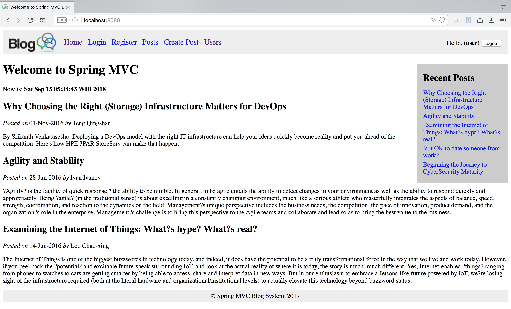

# Spring Boot MVC BLog

### A Simple Blog using Spring MVC

Login Account : naruto / naruto

#### References --> [here](http://www.nakov.com/blog/2016/08/05/creating-a-blog-system-with-spring-mvc-thymeleaf-jpa-and-mysql/)

### Screenshot

Login Page

Register Page

Home Page

Create Post Page

List Post Page

Users List Page

